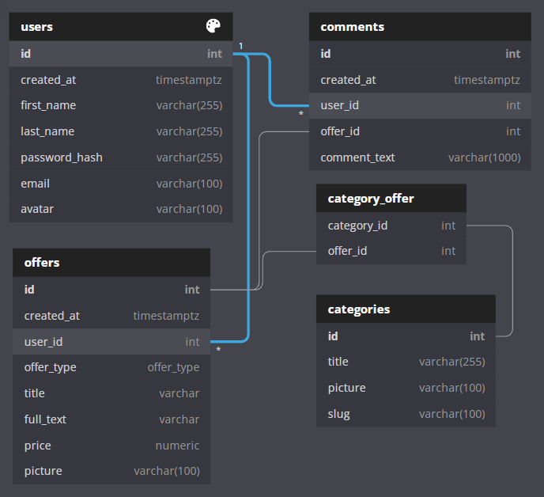

# ЗАДАНИЕ 1. Frontend-модуль

Соберите адаптивный лендинг на произвольную тему из Bootstrap-компонентов, стилизуйте его на своё усмотрение, чтобы лендинг не выглядел 100% копией стандартных элементов.

Лендинг должен содержать хедер, футер и 4-5 контент-содержащих компонентов с разными сетками и разнотипными элементами внутри. Один из модулей сделайте формой отправки вопроса (поля для email, имени, текста вопроса), также добавьте модальное окно с формой подписки на обновления.

В качестве шаблона использовал предложенный:


# Результат

## Готовая страница на GitHub Pages

[Готовая страница на GitHub Pages](https://phpnick.github.io/business-help-test/bootsrap-landing/)

## Код в GitHub репозитории

[Код в GitHub репозитории](https://github.com/PhpNick/business-help-test/tree/main/bootsrap-landing)

# ЗАДАНИЕ 2. Backend-модуль

Есть схема базы данных для сайта объявлений, похожего на Avito, со следующими сущностями:



По предложенной диаграмме напишите следующие SQL-запросы:
Выполнение всех запросов не обязательно, сделайте столько, сколько сможете.
Задачи разработаны для среды PostgreSQL.
Важны именно сами запросы, даже ход мыслей, поэтому можно не создавать реальную базу данных с наполнением.

1. Выберите список всех комментариев, созданных пользователем с идентификатором 1. Поля для вывода: id, created_at, offer_id, comment_text.

2. Выведите список объявлений (id, created_at, user_id, offer_type, title, price, picture), опубликованных в октябре 2021 года с сортировкой по дате публикации от самых свежих к более поздним. Дату публикации выведите в формате ‘DD.MM.YYYY’.

3. Выберите список пользователей, которые ещё не опубликовали ни одного объявления. Поля для вывода: идентификатор пользователя, email, дата регистрации, имя и фамилия одной строкой как ‘user_name’. Отсортируйте по возрастанию даты регистрации.

4. Выберите среди всех объявлений на продажу самые дорогие товары, их количество динамическое и заранее неизвестно.
Выведите их идентификаторы, автора (имя, фамилия), заголовки и цену продажи. 

5. Для вывода на сайте выберите список всех категорий, в которых есть хотя бы одно объявление с указанием количества объявлений по каждой категории. Выведите id категории, title, slug, количество объявлений (offer_amount).

# Результат

1. Выберите список всех комментариев, созданных пользователем с идентификатором 1. Поля для вывода: id, created_at, offer_id, comment_text.

```sql
select c.id, c.created_at, c.offer_id, c.comment_text
from comments c
inner join users u on c.user_id=u.id
where u.id = 1;
```

2. Выведите список объявлений (id, created_at, user_id, offer_type, title, price, picture), опубликованных в октябре 2021 года с сортировкой по дате публикации от самых свежих к более поздним. Дату публикации выведите в формате ‘DD.MM.YYYY’.

```sql
select o.id, to_char(o.created_at::date, 'dd.mm.yyyy'), o.user_id, o.offer_type, o.title, o.price, o.picture
from offers o
where o.created_at::text like '2021-10-%'
order by o.created_at desc;
```

3. Выберите список пользователей, которые ещё не опубликовали ни одного объявления. Поля для вывода: идентификатор пользователя, email, дата регистрации, имя и фамилия одной строкой как ‘user_name’. Отсортируйте по возрастанию даты регистрации.

```sql
select concat_ws(' ', u.id, u.email, u.created_at, u.first_name, u.last_name) as user_name
from users u
left join offers o
on o.user_id = u.id
where o.user_id is null
order by u.created_at;
```

4. Выберите среди всех объявлений на продажу самые дорогие товары, их количество динамическое и заранее неизвестно.
Выведите их идентификаторы, автора (имя, фамилия), заголовки и цену продажи. 

```sql
select o.id, o.title, o.price, u.first_name, u.last_name
from offers o, users u
where u.id = o.user_id and price = (select max(price) from offers);
```

5. Для вывода на сайте выберите список всех категорий, в которых есть хотя бы одно объявление с указанием количества объявлений по каждой категории. Выведите id категории, title, slug, количество объявлений (offer_amount).

```sql
select ca.id, ca.title, ca.slug, count(o.id) as offer_amount
from categoryoffer co 
join offers o on co.offer_id = o.id 
join categories ca on co.category_id = ca.id 
group by (ca.id);
```